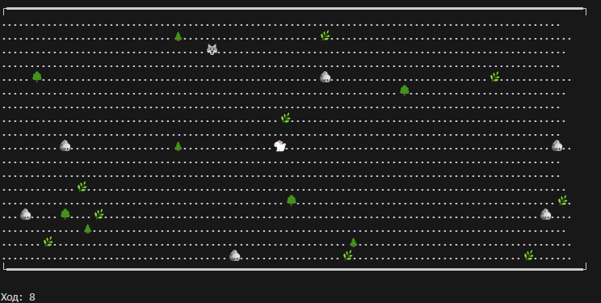

# Simulation

### Для запуска проекта:
php index.php

### Описание проекта
Проект представляет собой симуляцию мира, состоящего из ресурсов и статичных объектов: деревьев, камней, травы; а также сущностей: хищников и травоядных. Травоядные питаются травой и ищут ее, хищники охотятся на травоядных.

### Интерфейс:

### Возможные доработки проекта:
    - Рандомное расположение объектов на карте
    - Добавление травы и травоядных, если их становится слишком мало
    - Отображение счетчика очков здоровья для существ